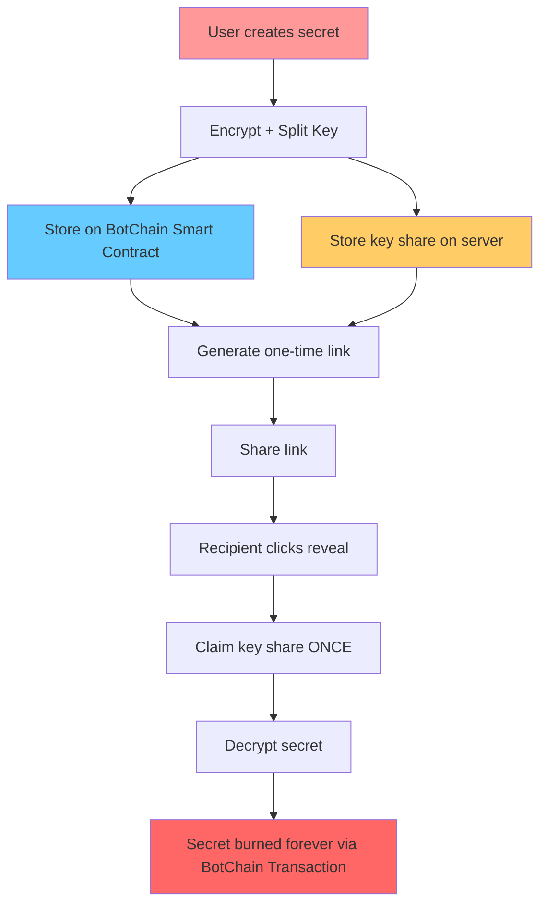
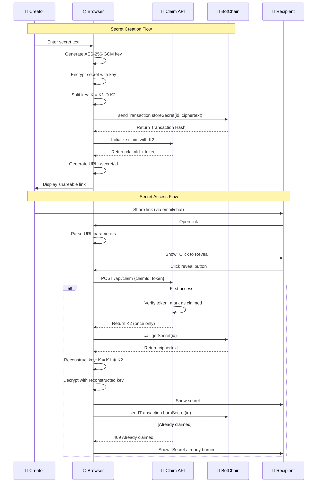
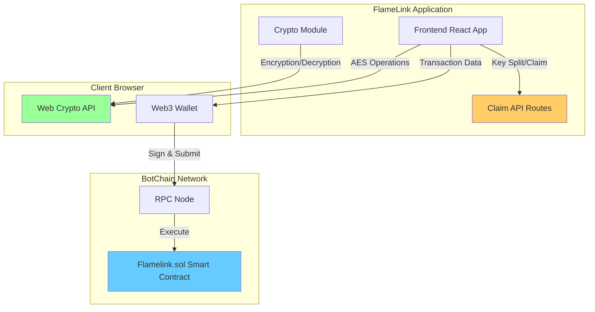
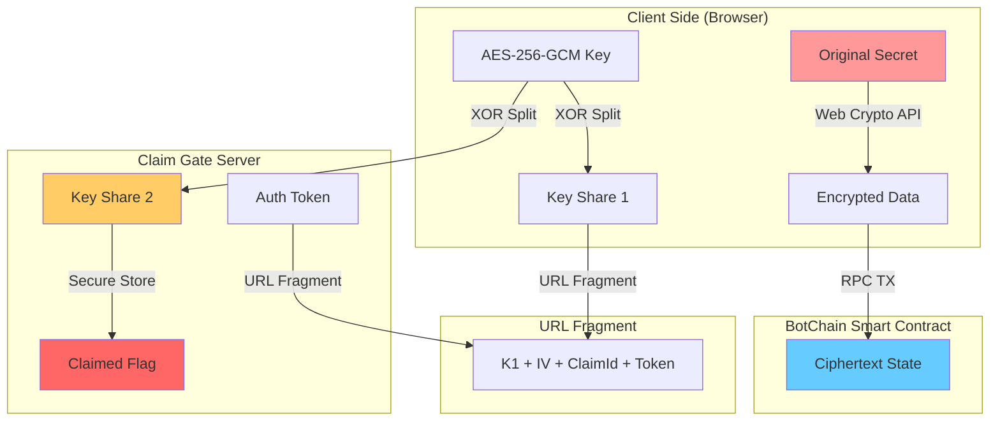
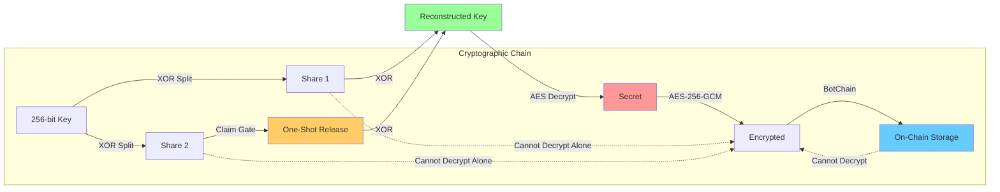

# 🔥 FlameLink Architecture Documentation

> **Decentralized One-Time Secrets on BotChain EVM**

FlameLink combines **BotChain EVM Smart Contracts** with **client-side encryption** and a **one-time claim gate** to create truly unstoppable, trustless one-time secrets.

---

## 🎯 Simple Overview



**Key Innovation**: The AES decryption key is split in two. Half goes in the URL, half is stored server-side and can only be claimed once. The ciphertext is stored publicly on BotChain, requiring a small gas fee to store and a small gas fee to burn.

---

## 🏗️ Detailed Flow Diagram



---

## 🐋 BotChain Integration Architecture



### BotChain Endpoints Used

- **RPC**: `https://rpc.botchain.ai`
- **Chain ID**: `677`

---

## 🔐 Security Architecture



### Security Properties

1. **Zero-Knowledge**: Server never sees plaintext secrets
2. **Key Separation**: Decryption impossible without both K1 (client) and K2 (server)
3. **One-Time Claim**: K2 can only be retrieved once, ever
4. **Client-Side Crypto**: All encryption/decryption in browser
5. **Decentralized Storage**: Stored publicly on EVM (but encrypted)
6. **No Local Storage**: Nothing persisted in browser

---

## 📊 Component Breakdown

### Frontend Components

```mermaid
graph TB
    subgraph "React Components"
        HOME[HomePage]
        SECRET[SecretPage]
    end
    
    subgraph "Utility Modules"
        CRYPTO[crypto.ts]
        BOTCHAIN[botchain.ts]
    end
    
    subgraph "API Routes"
        INIT[/api/claim/init]
        CLAIM[/api/claim]
    end
    
    HOME --> CRYPTO
    HOME --> BOTCHAIN
    HOME --> INIT
    
    SECRET --> CRYPTO
    SECRET --> BOTCHAIN
    SECRET --> CLAIM
    
    style CRYPTO fill:#99ff99
    style BOTCHAIN fill:#66ccff
    style INIT fill:#ffcc66
    style CLAIM fill:#ffcc66
```

### File Structure
```
src/
├── app/
│   ├── secret/[blobId]/
│   │   └── page.tsx             # Secret reveal page
│   ├── api/claim/
│   │   ├── init/route.ts        # Initialize claim gate
│   │   └── route.ts             # One-time claim endpoint
│   ├── lib/
│   │   ├── crypto.ts            # Encryption utilities
│   │   └── botchain.ts          # BotChain EVM integration
│   ├── layout.tsx               # App layout
│   └── page.tsx                 # Homepage
contracts/
└── Flamelink.sol                # Storage Smart Contract
```

---

## 🛡️ Security Model

### Threat Model

| Attack Vector | Mitigation |
|---------------|------------|
| **Server Compromise** | Server never sees plaintext; only stores random K2 shares |
| **Network Interception** | HTTPS + key in URL fragment (never sent to server) |
| **Multiple Access** | Claim gate ensures K2 released only once |
| **BotChain Data Access** | All data is AES-256 encrypted on-chain |
| **Browser Extension** | Client-side crypto; no persistent storage |

### Cryptographic Guarantees



---

## 🚀 Deployment Architecture

### Development Setup
- **Frontend**: Next.js 15 with React 19
- **Storage**: BotChain Mainnet Smart Contracts
- **Claim Gate**: In-memory Map (dev only)
- **Crypto**: Web Crypto API (browser native)

### Production Considerations

- Replace in-memory store with Redis/Upstash KV
- Deploy `Flamelink.sol` to production BotChain Mainnet

---

*Built with ❤️ using Next.js, BotChain EVM, and Web Crypto API*
